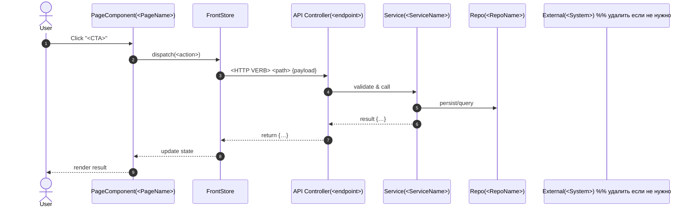
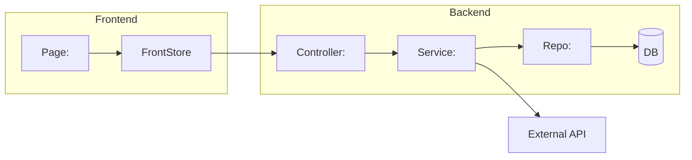

# AGENTS — Operating Rules for Cursor Agents

Версия: 1.4  
Цель: зафиксировать **циклический процесс по Feature Pack (FP)**, где агенты идут по «рельсам», используют существующие React-страницы как прототипы (часть с мок-данными), и на каждом этапе выполняют согласование со стейкхолдером (ACK) и короткую рефлексию.

**Короткие команды для стейкхолдера** (пишите прямо в чат):  
`FP=FP1 mode=extractor - собрать контекст и заполнить базовые документы`  
`FP=FP1 mode=discovery - начать`  
`FP=FP1 mode=design-first - синхронизируй UX_MAP и решения`
`FP=FP1 mode=design-first — изменение UI:`  
`FP=FP1 mode=tests-red — оформи UAT/BDD и RTM`  
`FP=FP1 mode=implement — доведи до зелёного`  
`FP=FP1 mode=gate — приёмка`

> **Важно про UI**: прототипы уже существуют как React-страницы. Новые прототипы **не создаём**. Страницы с мок-данными считаем «прототип-базой». При реализации по FP моки заменяются на реальные запросы строго по `docs/API.yaml`.

---

## 1) Минимальные документы (источники истины)

- `docs/WORKPLAN.yaml` — статусы FP, этапы, риски, **ACK/рефлексия**, пороги, артефакты.
- `docs/REQUIREMENTS.md` — требования (FR + NFR), ограничения (проектный уровень).
- `docs/API.yaml` — OpenAPI контракт (единый).
- `docs/MODEL.sql` — SQL/ER-модель.
- `docs/UX_MAP.md` — **UI Action Map**: CTA → Endpoint → State → **Page (React)** → **mock_status** (mock/mixed/real/unknown). + Диаграммы по FP (см. ниже).
- `docs/TESTS.md` — стратегия, **UAT/BDD** (человеческим языком), **Acceptance**, **RTM (YAML: requirement→tests→code)**.
- `docs/QNA_DECISIONS.md` — Вопросы/Ответы/ГАПы + **краткие ADR** (в одном файле).

> Новые документы/папки создавать **нельзя**, кроме артефактов, и только после записи причины (ADR) в `docs/QNA_DECISIONS.md`.

---

## 2) Машиночитаемый Workflow

```yaml
workflow:
  name: "DEVELOPMENT-FP-LIFECYCLE"
  version: "1.4"
  loop: "per-feature-pack"

  fp_statuses: [discovery, plan, design-first, tests-red, implement, tests-green, gate, released]

  documents:
    workplan: "docs/WORKPLAN.yaml"
    requirements: "docs/REQUIREMENTS.md"
    api: "docs/API.yaml"
    model: "docs/MODEL.sql"
    ux_map: "docs/UX_MAP.md"
    tests: "docs/TESTS.md"            # включает UAT/BDD, Acceptance, RTM (YAML)
    qna_decisions: "docs/QNA_DECISIONS.md"

  artifacts_policy:
    commit_to_git: false
    ci_publish: true
    local_dir_pattern: "artifacts/${FP_ID}/${YYYY}-${MM}-${DD}/"
    required:
      - "logs/back-tests.log"
      - "logs/front-tests.log"
      - "coverage/coverage-back.json"
      - "coverage/coverage-front.json"
      - "evidence/demo-notes.txt"     # текст: сценарий демо и наблюдения (без скринов/видео)
      - "evidence/links.md"           # ссылки на PR/CI/ADR

  coverage_thresholds:
    back:  { lines: 0.60, functions: 0.50, branches: 0.45, statements: 0.60 }
    front: { lines: 0.80, functions: 0.70, branches: 0.65, statements: 0.80 }

  stakeholder_ack:
    required_at: [discovery, plan, design-first, tests-red, gate]   # явный ACK стейкхолдера
    record_in: "docs/WORKPLAN.yaml"
    alt_record: "docs/QNA_DECISIONS.md"

  reflection:
    at: [discovery, plan, design-first, tests-red, implement, tests-green, gate]
    record_to: "docs/WORKPLAN.yaml"   # блок reflection: what went well / risks / next focus

  gates:
    design_ready:
      requires:
        - "docs/UX_MAP.md: FP CTA заполнены (CTA→Endpoint→State→Page→mock_status)"
        - "docs/UX_MAP.md: раздел 'System Design (per CTA)' — по 1 mermaid sequenceDiagram на КАЖДЫЙ CTA из FP"
        - "docs/UX_MAP.md: раздел 'System Interaction Overview (FP)' — обзорная mermaid flow/component диаграмма"
        - "docs/API.yaml и docs/MODEL.sql согласованы по сущностям/эндпойнтам FP (или ADR+TODO)"
        - "docs/QNA_DECISIONS.md: ADR по критическим решениям для FP"
        - "Stakeholder ACK записан (см. stakeholder_ack)"
    tests_red_ready:
      requires:
        - "docs/TESTS.md: UAT/BDD для FP (понятным языком)"
        - "docs/TESTS.md: RTM-блок (requirement→tests)"
        - "Прогоны красных тестов выполнены; пути к логам в artifacts/.../logs/*"
        - "Stakeholder ACK записан"
    tests_green_ready:
      requires:
        - "Все UAT/BDD зелёные; coverage json-summary сохранены"
        - "Пороги coverage соблюдены (см. coverage_thresholds)"
        - "docs/UX_MAP.md актуализирован, если CTA/страницы/привязки менялись"
    release_gate:
      requires:
        - "docs/TESTS.md: Acceptance Checklist по FP закрыт"
        - "docs/TESTS.md: RTM покрытие = 100% по FP"
        - "docs/QNA_DECISIONS.md: ADR-решения зафиксированы"
        - "artifacts/.../evidence/links.md"
        - "Stakeholder ACK записан"

  transitions:
    - { from: discovery,    to: plan,         guard: "Крит. вопросы зафиксированы; нет блокирующих без владельца; ACK" }
    - { from: plan,         to: design-first, guard: "WORKPLAN.yaml по FP заполнен; риски/timebox/WIP; ACK" }
    - { from: design-first, to: tests-red,    guard: "design_ready passed" }
    - { from: tests-red,    to: implement,    guard: "tests_red_ready passed" }
    - { from: implement,    to: tests-green,  guard: "Все тесты исполнены; артефакты сохранены" }
    - { from: tests-green,  to: gate,         guard: "tests_green_ready passed" }
    - { from: gate,         to: released,     guard: "release_gate passed (с ACK)" }

  fallback_rules:
    mismatch_after_green:
      trigger: "Ревью/демо показывает несоответствие ожиданиям"
      action:
        - "Внести GAP/Question в docs/QNA_DECISIONS.md (с шагами и наблюдением в тексте)"
        - "Получить Answer и добавить краткую ADR-запись"
        - "Обновить UAT/BDD в docs/TESTS.md (сделать кейс красным)"
        - "Вернуться в implement → довести до зелёного → снова пройти gate (с ACK)"
````

---

## 3) Context Contracts per Mode (что читать, где брать контекст, что править)

> На каждом этапе агент **сначала выполняет Context Bootstrap**, чтобы исключить «езда» и промахи по ожиданиям.

### Общие правила чтения/приоритетов (если конфликт):

1. **ADR** из `docs/QNA_DECISIONS.md` (самая высокая сила)
2. `docs/REQUIREMENTS.md`
3. `docs/API.yaml` ↔ `docs/MODEL.sql` (согласованная пара; при расхождении — вопрос/ADR)
4. `docs/UX_MAP.md` (карта CTA→Endpoint→State→Page→mock\_status)
5. `docs/TESTS.md` (UAT/BDD, RTM)

> При несоответствии UAT vs REQUIREMENTS без ADR — **нельзя** продолжать реализацию; оформить Question→ADR.

---

### Mode: **extractor**

**Context Bootstrap:** `examples/**`  `REQUIREMENTS.md`  `API.yaml`  `MODEL.sql`  `UX_MAP.md`  `TESTS.md`  `WORKPLAN.yaml`  `QNA_DECISIONS.md`
**Write:** `REQUIREMENTS.md`, `API.yaml`, `MODEL.sql`, `UX_MAP.md` (CTA/FP Assignment), `TESTS.md` (Strategy), `WORKPLAN.yaml` (список FP и scope), `QNA_DECISIONS.md` (Questions/Gaps)
**Do not edit:** код, пороги, структура документов; не создавать новые файлы/папки.

---

### Mode: **discovery**

**Context Bootstrap (read-order):**
`REQUIREMENTS.md` → `API.yaml` → `MODEL.sql` → `UX_MAP.md` → `TESTS.md` → `QNA_DECISIONS.md` → `WORKPLAN.yaml`
**Write:** `QNA_DECISIONS.md` (Questions/Gaps/ADR), `UX_MAP.md` (добавить/уточнить для FP), `WORKPLAN.yaml` (stage, blockers, ACK, reflection)
**Do not edit:** код, пороги, структура документов.

---

### Mode: **plan**

**Context Bootstrap:** `WORKPLAN.yaml` → `UX_MAP.md` (CTA/Pages/mock\_status) → `REQUIREMENTS.md`
**Write:** `WORKPLAN.yaml` (задачи FP, риски, spikes, timebox/WIP, Gate-пороги, артефакты, ACK), **ссылки** на `UX_MAP.md`
**Do not edit:** код.

---

### Mode: **design-first**

**Context Bootstrap:** `MODEL.sql` ↔ `API.yaml` ↔ `UX_MAP.md` → `QNA_DECISIONS.md` → `REQUIREMENTS.md` → `WORKPLAN.yaml`

**Что сделать (строго):**

1. Сверить `MODEL.sql` и `API.yaml` по сущностям/полям/типам; все расхождения — в `docs/QNA_DECISIONS.md` (Question→Answer→ADR).
2. Обновить `docs/UX_MAP.md` (только для текущего FP): у каждого CTA заполнить **Page / Endpoint(s) / State keys / Mock Status**.
3. **Проектирование взаимодействий (обязательно):**

   * В `docs/UX_MAP.md` добавить раздел `## System Design (per CTA)` и для **каждого CTA из FP** создать **одну** диаграмму:

     * `mermaid` `sequenceDiagram` с участниками: `User`, `PageComponent`, `FrontStore`, `API Controller`, `Service`, `Repo`, `External` (если есть).
   * В `docs/UX_MAP.md` добавить `## System Interaction Overview (FP)` — **обзорную component/flow**-диаграмму `mermaid` с модулями backend, слоями front и внешними системами.
4. В `docs/WORKPLAN.yaml`: `status: design-first`, `reflection`, записать **ACK** стейкхолдера.

**Запрещено:** менять код/пороги/структуру документов.
**Goal:** пройти Gate `design_ready`.

---

### Mode: **tests-red**

**Context Bootstrap:** `TESTS.md` → `UX_MAP.md` → `REQUIREMENTS.md` → `API.yaml` → `WORKPLAN.yaml`

**Двухфазный порядок (строго):**

**A) Phase: SPEC (без кода)**
1) В `docs/TESTS.md` (раздел FP):
   - UAT/BDD (plain language: шаги пользователя, ожидания в UI и в данных).
   - Системные/интеграционные/юнит — перечень.
   - **RTM (YAML):** requirement → tests → code_targets (front/back).
   - **Planned Test Files:** список путей/имён будущих тестов.
2) Обновить `docs/WORKPLAN.yaml` для FP:
   - `status: tests-red`
   - `tests_phase: spec`
   - `reflection: "<коротко>"`
   - запросить и записать **ACK** стейкхолдера на спецификацию тестов.
3) **Запрещено:** писать/менять любой код тестов и реализацию; запускать можно только уже существующие тесты, но **они не являются основанием** для перехода.

**B) Phase: CODE (только после ACK на Spec)**
1) Убедиться, что в `WORKPLAN.yaml` для FP стоит `tests_phase: spec` и есть `ack`.
2) Написать **только** тестовый код согласно «Planned Test Files» из `TESTS.md`. Реализацию **не трогать**.
3) Прогнать тесты; получить **красные** по новым кейсам (ожидаемо).
4) Сохранить артефакты:
   - `artifacts/<FP>/<date>/logs/*` (вывод прогонов),
   - при необходимости промежуточный coverage-summary.
5) Обновить `WORKPLAN.yaml`:
   - `tests_phase: code`
   - `reflection: "<коротко>"`

**Gate → `tests_red_ready` (минимум):**
- `TESTS.md`: UAT/BDD + RTM + Planned Test Files (ACK на Spec зафиксирован).
- Новые тесты **написаны** и падают по ожидаемым причинам (красные прогоны есть).
- Пути к логам указаны (`artifacts/.../logs/*`).
- В `WORKPLAN.yaml`: `status: tests-red`, `tests_phase: code`, есть **ACK** на Spec.


---

### Mode: **implement**

> Guard: запрещено начинать `implement`, пока не выполнен `tests_red_ready` (см. выше) и в `WORKPLAN.yaml` не стоит `tests_phase: code` с Evidence.


**Context Bootstrap (строго!):**

1. **RTM** из `TESTS.md` (что нужно «зеленить»)
2. **UAT/BDD** сценарии (что должно видеть/чувствовать пользователь)
3. **UX\_MAP.md** — **для FP** перечень CTA → Endpoint → State → **Page (React)** → **mock\_status**
4. `API.yaml` — контракты используемых Endpoint
5. `MODEL.sql` — какие таблицы/поля задействованы
6. `WORKPLAN.yaml` — задачи/риски

**Scope Resolution (что именно реализовать):**

* **Берём список CTA/Pages для FP из `UX_MAP.md`**. Для каждой записи:
  `cta_id, page_path (react), mock_status, endpoint(s), state_keys`.
* **Если `mock_status=mock` или `mixed`** — именно эти компоненты/страницы **подлежат замене моков на реальные запросы** для указанных endpoint.
* **Проверить**, что используемые endpoint описаны в `API.yaml` **и** требуемые данные предусмотрены в `MODEL.sql`. При расхождениях — **Question→ADR** (нельзя «домысливать»).
* **Свериться с RTM**: какая часть функционала должна стать зелёной (unit/integration/e2e).

**Write (по итогу):**

* Код: `front/src/**` (только соответствующие страницы/CTA из `UX_MAP.md`), `back/src/**` (только обслуживающие endpoint из `API.yaml`).
* Артефакты: `artifacts/<FP>/<date>/coverage/*.json`, `.../logs/*`
* Документы: при изменении соответствий CTA/Endpoint/State — обновить `UX_MAP.md`.
* `WORKPLAN.yaml`: короткая рефлексия.

**Запреты:**

* Нельзя править **не указанные** в `UX_MAP.md` страницы/CTA в рамках FP.
* Нельзя менять `API.yaml`/`MODEL.sql` без записи Question→ADR.
* Нельзя удалять или «затерять» страницы с моками; моки снимаются **только** там, где `UX_MAP.md` помечает этот FP.

---

### Mode: **tests-green**

**Context Bootstrap:** `TESTS.md` (RTM, UAT/BDD) → `UX_MAP.md` → `WORKPLAN.yaml`
**Actions:** прогнать тесты; проверить пороги; сохранить coverage json-summary и логи; **evidence/demo-notes.txt** — текстовый сценарий демо + факт наблюдения (без скринов/видео).
**Write:** `WORKPLAN.yaml` (рефлексия).
**Goal:** Gate `tests_green_ready`.

---

### Mode: **gate**

**Context Bootstrap:** `TESTS.md` (Acceptance, RTM), `QNA_DECISIONS.md`, `WORKPLAN.yaml`, артефакты `artifacts/<FP>/<date>/...`
**Actions:** пройти Acceptance; проверить RTM=100%; ADR/вопросы закрыты; собрать `evidence/links.md` (PR/CI/ADR); **ACK** зафиксировать в `WORKPLAN.yaml`.
**Decision:** PASS/REJECT (+ причина и целевой возвратный mode).

---

## 4) Гейты и пороги (человеческое резюме)

* **design\_ready** — не пропускаем без:

  * актуальных `MODEL.sql` и `API.yaml` для всех сущностей/эндпойнтов FP (или ADR + TODO),
  * заполненных CTA (Page/Endpoint/State/Mock) в `UX_MAP.md`,
  * разделов диаграмм в `UX_MAP.md`: **System Design (per CTA)** (по 1 `sequenceDiagram` на CTA) и **System Interaction Overview (FP)**,
  * ADR в `QNA_DECISIONS.md`,
  * зафиксированного **ACK** в `WORKPLAN.yaml`.

* **tests_red_ready — проходит только если:**
- В `TESTS.md` оформлены UAT/BDD, RTM, Planned Test Files, и есть **ACK** на спецификацию (Phase: SPEC).
- Тестовый код по плану создан (Phase: CODE), прогоны **красные по ожидаемым причинам**; пути к логам в `artifacts/.../logs/*`.
- `WORKPLAN.yaml` для FP: `status=tests-red`, `tests_phase=code`, `reflection` обновлён.


* **tests\_green\_ready** — все UAT/BDD зелёные; пороги coverage соблюдены; `UX_MAP.md` актуализирован.

* **release\_gate** — Acceptance закрыт; RTM=100% по FP; ADR на месте; артефакты собраны; **ACK** есть.

---

## 5) Политики и запреты (anti-bypass)

* **Нельзя** менять: `AGENTS.md`, coverage-пороги, workflow, структуру документов.
* В режиме mode=extractor **разрешено** заполнять и редактировать docs/REQUIREMENTS.md напрямую
* **Нельзя** редактировать `REQUIREMENTS.md` напрямую: любые изменения вне extractor только через `QNA_DECISIONS.md` (Question→Answer→ADR).
* **Нельзя** снимать моки со страниц **вне** mode `implement` и **вне** CTA/Pages, указанных в `UX_MAP.md` для данного FP.
* **Нельзя** изменять статусы FP в `WORKPLAN.yaml` без Evidence и без **ACK**, где он требуется.
* **Нельзя** удалять записи Questions/Gaps/ADR — только помечать «closed» с ссылкой на решение.
* **Web/MCP** — **выключены** всегда.
* **Нельзя** добавлять новые документы/папки (кроме артефактов) без ADR-обоснования в `QNA_DECISIONS.md`.
* **Language**: всегда отвечать пользователю по‑русски. В документах использовать русский язык по возможности; английский допустим только для кода, идентификаторов, API/SQL и цитат из исходных спецификаций.

---

## 6) Рефлексия и ACK

На этапах `discovery, plan, design-first, tests-red, implement, tests-green, gate` — записывать краткую **рефлексию** в `WORKPLAN.yaml`.
На этапах `discovery, plan, design-first, tests-red, gate` — обязателен **ACK** стейкхолдера (by, at, scope).

---

## 7) Fallback при несоответствии ожиданиям

1. Записать GAP/Question в `QNA_DECISIONS.md` (с шагами воспроизведения в тексте).
2. Получить Answer и добавить короткую ADR-запись там же.
3. Обновить UAT/BDD в `TESTS.md`, сделать кейс **красным**.
4. Вернуться в `implement` → довести до зелёного → снова `gate` (с ACK).

---

## 8) Change Requests (CR) — как обрабатываем изменения UI/поведения

Триггер: любое задание от стейкхолдера в духе «поправить UI», «сменить редирект», «добавить валидацию», «переименовать кнопку», «изменить сообщение об ошибке» и т.п.

Алгоритм (один FP):
1) mode=design-first
   - QNA_DECISIONS.md: создать GAP; после согласования — Answer + короткая ADR "<тема изменения>".
   - REQUIREMENTS.md: добавить/уточнить соответствующий FR/NFR.
   - UX_MAP.md:
     - обновить строку(и) CTA/Page (Endpoint/State/Navigation).
     - обновить диаграммы: *System Design (per CTA)* (sequence) и, если нужно, *Overview (FP)*.
   - API.yaml / MODEL.sql: править только при необходимости для нового поведения; иначе — зафиксировать "no change".
   - **Impact Analysis (обязательно)**: в конце UX_MAP.md добавить таблицу:
     ```
     | Change ID | CTA_ID | Files.front | Files.back | Tests.toCreateOrUpdate |
     |-----------|--------|-------------|------------|------------------------|
     | CR-YYYYMMDD-01 | CTA-023 | ["src/pages/ProjectCreate.tsx"] | ["src/modules/projects/controller.ts"] | ["front/__tests__/fp001/create.redirect.test.tsx","back/.../projects.e2e.spec.ts"] |
     ```
   - WORKPLAN.yaml: reflection и **ACK** (scope=FP:<id>:design-first-CR).
   - Gate design_ready перепроходим логически (диаграммы + Impact Analysis обязательны).

2) mode=tests-red (две фазы)
   - **SPEC**: обновить UAT/BDD и RTM по изменению; заполнить *Planned Test Files*; запросить и записать **ACK**.
   - **CODE**: написать тесты по плану; добиться ожидаемо **красных** по новым кейсам; сохранить логи в artifacts; WORKPLAN.yaml: `tests_phase: code`.

3) mode=implement
   - Реализовать **строго** по Impact Analysis и RTM; снять/изменить только затронутые части.
   - Прогнать тесты до зелёного; сохранить coverage/logs; при изменении привязок обновить UX_MAP.md.

4) mode=gate
   - Пройти Acceptance; RTM=100%; ADR/ACK на месте; вынести PASS/REJECT.


## 9) Appendix — Diagram Templates (копируйте в `UX_MAP.md`)

**Sequence (per CTA):**



**Overview (per FP):**


