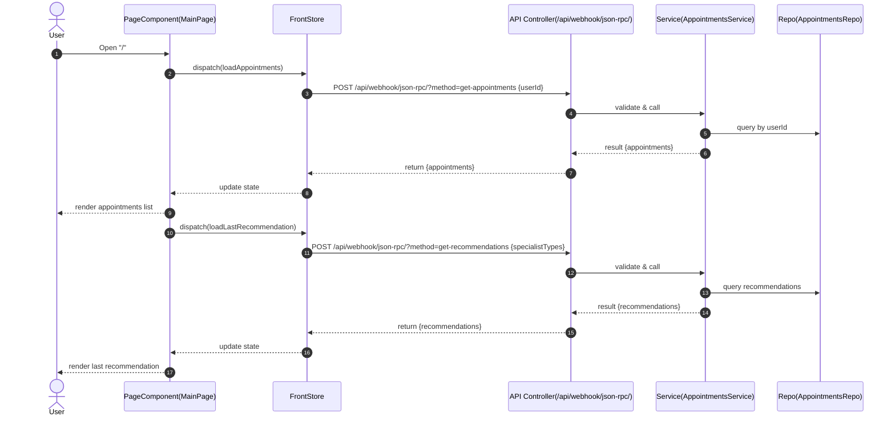
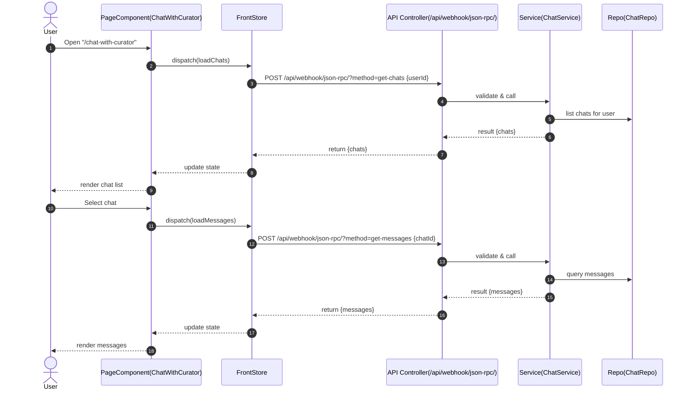
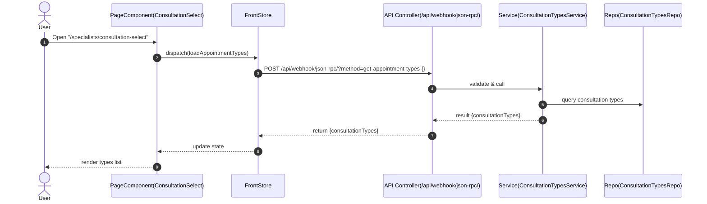
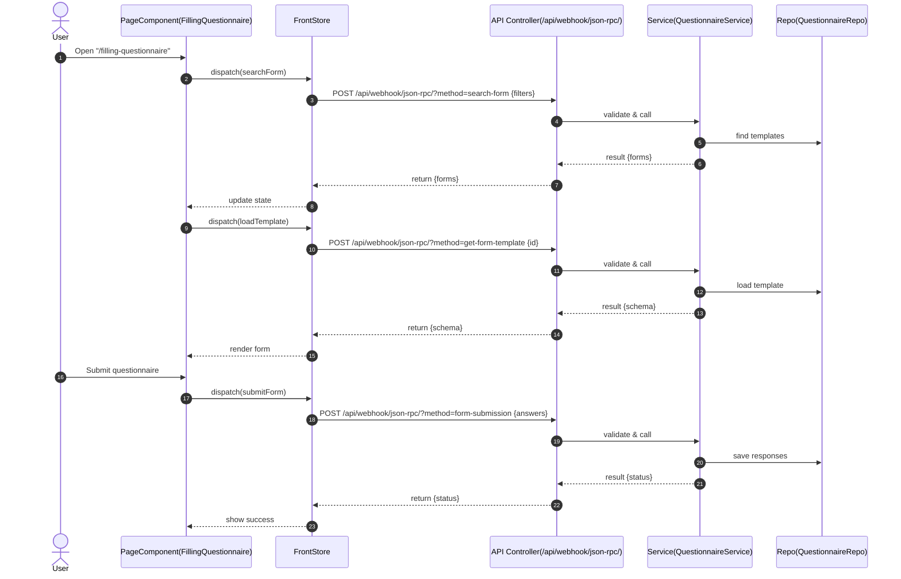
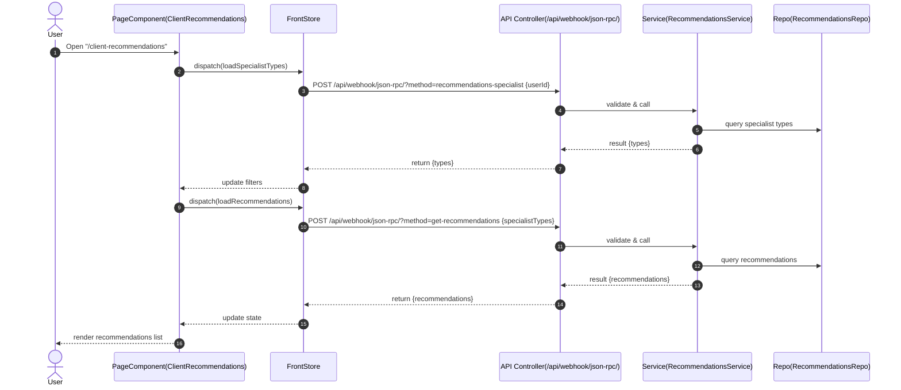
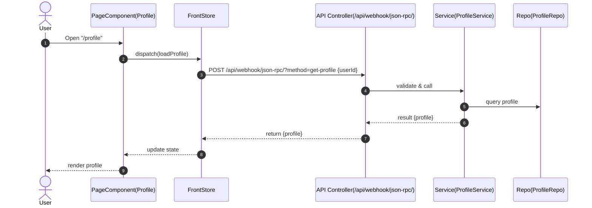
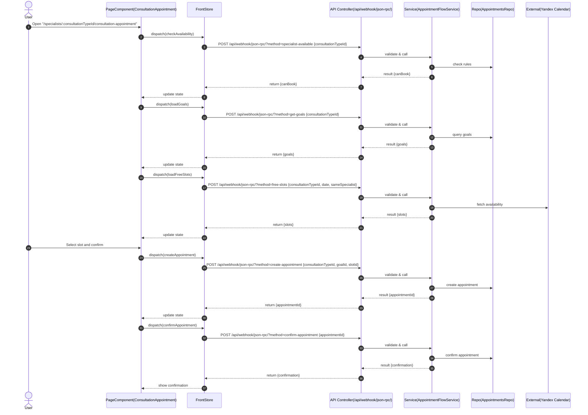
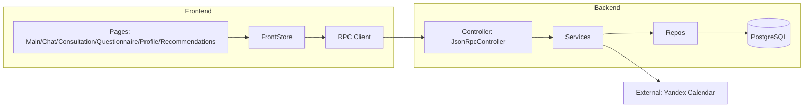

# UX Action Map (CTA -> Endpoint -> State -> Page)

> Source of truth for implement: only CTAs listed here can have mocks removed within an FP.

## MVP CTA

| CTA_ID | Page (React) | Route | Mock Status (mock/mixed/real/unknown) | Endpoint(s) (method path) | State keys | Notes |
|---|---|---|---|---|---|---|
| CTA-003 | front/handmade/proj-prosto-zdorovo-frontend-develop/src/app/pages/main-page/main-page.tsx | / | mock | RPC get-appointments; RPC get-recommendations | client.appointments, recommendations.last | MVP: Main page (appointments list + last recommendation) |
| CTA-004 | front/handmade/proj-prosto-zdorovo-frontend-develop/src/app/pages/chat-with-curator/chat-with-curator.tsx | /chat-with-curator | mock | RPC get-chats; RPC get-messages | chats.list; chats.messages | MVP: Client chat with curator only |
| CTA-005 | front/handmade/proj-prosto-zdorovo-frontend-develop/src/app/pages/consultation-select/consultation-select.tsx | /specialists/consultation-select | mock | RPC get-appointment-types | appointments.select | MVP: Start booking (consultation type selection) |
| CTA-006 | front/handmade/proj-prosto-zdorovo-frontend-develop/src/app/pages/filling-questionnaire/filling-questionnaire.tsx | /filling-questionnaire | mock | RPC search-form; RPC get-form-template; RPC form-submission | questionnaires.submit | MVP: Post-booking questionnaire |
| CTA-008 | front/handmade/proj-prosto-zdorovo-frontend-develop/src/app/pages/client-recommendations/client-recommendations.tsx | /client-recommendations | mock | RPC get-recommendations; RPC recommendations-specialist | recommendations.list; recommendations.filters | MVP: Client recommendations page |
| CTA-019 | front/handmade/proj-prosto-zdorovo-frontend-develop/src/app/pages/profile/profile.tsx | /profile | mock | RPC get-profile | clients.profile | MVP: Client profile page; view-only (FR-026) |
| CTA-020 | front/handmade/proj-prosto-zdorovo-frontend-develop/src/app/pages/consultation-appointment/consultation-appointment.tsx | /specialists/$consultationTypeId/consultation-appointment | mock | RPC specialist-available; RPC get-goals; RPC free-slots; RPC create-appointment; RPC confirm-appointment | appointments.create | MVP: Confirm appointment (slot + confirmation steps) |

## vNext CTA

| CTA_ID | Page (React) | Route | Mock Status (mock/mixed/real/unknown) | Endpoint(s) (method path) | State keys | Notes |
|---|---|---|---|---|---|---|
| CTA-001 | TBD | /register | unknown | POST /auth/register; POST /auth/verify-sms; POST /auth/verify-email | auth.registration | vNext: Client registration by policy |
| CTA-002 | TBD | /login | unknown | POST /auth/login | auth.session | vNext: Client login |
| CTA-007 | TBD | /meetings/:id | unknown | GET /appointments/{appointmentId} | meetings.link | vNext: Join video meeting (Yandex Telemost) |
| CTA-009 | TBD | /questionnaires | unknown | GET /clients/{clientId}/questionnaires | questionnaires.list | vNext: Client questionnaires list |
| CTA-010 | TBD | /notifications | unknown | GET /clients/{clientId}/notifications | notifications.list | vNext: Client notifications |
| CTA-011 | TBD | /specialist/login | unknown | POST /auth/login | auth.session | vNext: Specialist login |
| CTA-012 | TBD | /specialist/schedule | unknown | GET /specialists/{specialistId}/schedule; PUT /specialists/{specialistId}/schedule | specialist.schedule | vNext: Manage schedule (Yandex Calendar) |
| CTA-013 | TBD | /specialist/chats | unknown | GET /chats | chats.list | vNext: Specialist chats with curator only |
| CTA-014 | TBD | /specialist/clients/:id/questionnaire | unknown | GET /specialists/{specialistId}/clients/{clientId}/questionnaire | questionnaires.view | vNext: Specialist views client questionnaire |
| CTA-015 | TBD | /specialist/recommendations/new | unknown | POST /specialists/{specialistId}/recommendations | recommendations.create | vNext: Specialist creates recommendation |
| CTA-016 | TBD | /curator/login | unknown | POST /auth/login | auth.session | vNext: Curator login |
| CTA-017 | TBD | /curator/chats | unknown | GET /curator/chats | chats.list | vNext: Curator views all chats |
| CTA-018 | TBD | /curator/schedules | unknown | GET /curator/schedules | schedules.list | vNext: Curator views specialists' calendars |

### Notes
- Each row is a unit of implementation scope.
- If a page is partially real, use `mixed` and list which parts remain mocked.
- React prototypes for MVP are in `front/handmade/proj-prosto-zdorovo-frontend-develop`.
- CTA_ID uses format CTA-### and must be unique.
- FP001 scope is MVP only (front/handmade); vNext CTAs are deferred.

### FP Assignment
| CTA_ID | Page | Endpoint(s) | Assigned FP |
|---|---|---|---|
| CTA-003 | front/handmade/proj-prosto-zdorovo-frontend-develop/src/app/pages/main-page/main-page.tsx | RPC get-appointments; RPC get-recommendations | FP001 |
| CTA-004 | front/handmade/proj-prosto-zdorovo-frontend-develop/src/app/pages/chat-with-curator/chat-with-curator.tsx | RPC get-chats; RPC get-messages | FP001 |
| CTA-005 | front/handmade/proj-prosto-zdorovo-frontend-develop/src/app/pages/consultation-select/consultation-select.tsx | RPC get-appointment-types | FP001 |
| CTA-006 | front/handmade/proj-prosto-zdorovo-frontend-develop/src/app/pages/filling-questionnaire/filling-questionnaire.tsx | RPC search-form; RPC get-form-template; RPC form-submission | FP001 |
| CTA-008 | front/handmade/proj-prosto-zdorovo-frontend-develop/src/app/pages/client-recommendations/client-recommendations.tsx | RPC get-recommendations; RPC recommendations-specialist | FP001 |
| CTA-019 | front/handmade/proj-prosto-zdorovo-frontend-develop/src/app/pages/profile/profile.tsx | RPC get-profile | FP001 |
| CTA-020 | front/handmade/proj-prosto-zdorovo-frontend-develop/src/app/pages/consultation-appointment/consultation-appointment.tsx | RPC specialist-available; RPC get-goals; RPC free-slots; RPC create-appointment; RPC confirm-appointment | FP001 |

### FP Assignment (vNext)
| CTA_ID | Page | Endpoint(s) | Assigned FP |
|---|---|---|---|
| CTA-001 | TBD | POST /auth/register; POST /auth/verify-sms; POST /auth/verify-email | TBD |
| CTA-002 | TBD | POST /auth/login | TBD |
| CTA-007 | TBD | GET /appointments/{appointmentId} | TBD |
| CTA-009 | TBD | GET /clients/{clientId}/questionnaires | TBD |
| CTA-010 | TBD | GET /clients/{clientId}/notifications | TBD |
| CTA-011 | TBD | POST /auth/login | FP002 |
| CTA-012 | TBD | GET /specialists/{specialistId}/schedule; PUT /specialists/{specialistId}/schedule | FP002 |
| CTA-013 | TBD | GET /chats | FP002 |
| CTA-014 | TBD | GET /specialists/{specialistId}/clients/{clientId}/questionnaire | FP002 |
| CTA-015 | TBD | POST /specialists/{specialistId}/recommendations | FP002 |
| CTA-016 | TBD | POST /auth/login | FP003 |
| CTA-017 | TBD | GET /curator/chats | FP003 |
| CTA-018 | TBD | GET /curator/schedules | FP003 |

### System Design (per CTA)

#### CTA-003: Main page / appointments list

#### CTA-004: Chat with curator

#### CTA-005: Consultation type selection

#### CTA-006: Filling questionnaire

#### CTA-008: Recommendations list

#### CTA-019: Client profile

#### CTA-020: Appointment booking and confirmation

### System Interaction Overview (FP)

## Impact Analysis (CR)

| Change ID | CTA_ID | Files.front | Files.back | Tests.toCreateOrUpdate |
|---|---|---|---|---|
| CR-20260108-01 | CTA-004 | ["front/handmade/proj-prosto-zdorovo-frontend-develop/src/app/pages/chat-with-curator/chat-with-curator.tsx","front/handmade/proj-prosto-zdorovo-frontend-develop/src/api/rpc-request/chat/use-get-messages-by-chatid.ts","front/handmade/proj-prosto-zdorovo-frontend-develop/src/feature/chat/message-list/messages-list.tsx"] | ["back/src/jsonrpc.controller.ts","back/src/jsonrpc.service.ts"] | ["front/handmade/proj-prosto-zdorovo-frontend-develop/src/testing/fp001-chat-with-curator.test.tsx","back/test/fp001-chats.e2e-spec.ts"] |
| CR-20260108-01 | CTA-008 | ["front/handmade/proj-prosto-zdorovo-frontend-develop/src/app/pages/client-recommendations/client-recommendations.tsx","front/handmade/proj-prosto-zdorovo-frontend-develop/src/api/rpc-request/recommendation/use-get-recommendations-specialist.ts","front/handmade/proj-prosto-zdorovo-frontend-develop/src/app/pages/client-recommendations/components/filters-carousel.tsx"] | ["back/src/jsonrpc.controller.ts","back/src/jsonrpc.service.ts"] | ["front/handmade/proj-prosto-zdorovo-frontend-develop/src/testing/fp001-client-recommendations.test.tsx","back/test/fp001-recommendations.e2e-spec.ts"] |
