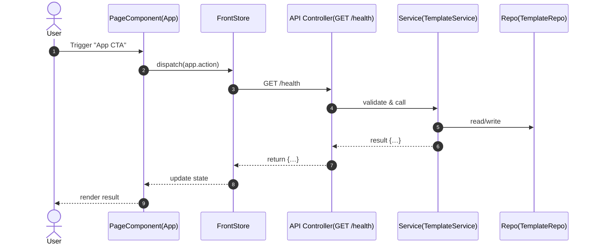
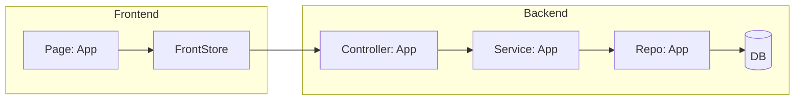

# UX Action Map (CTA → Endpoint → State → Page)

> Source of truth for implement: only CTAs listed here can have mocks removed within an FP.

| CTA_ID | Page (React) | Route | Mock Status (mock/mixed/real/unknown) | Endpoint(s) (method path) | State keys | Notes |
|---|---|---|---|---|---|---|
| CTA-000 | front/src/App.tsx | / | mock | GET /health | health.status | <notes> |

### Notes
- Each row is a unit of implementation scope.
- If a page is partially real, use `mixed` and list which parts remain mocked.

### FP Assignment
| CTA_ID | Page | Endpoint(s) | Assigned FP |
|---|---|---|---|
| CTA-000 | front/src/App.tsx | GET /health | FP000 |

### System Design (per CTA)

### System Interaction Overview (FP000)

